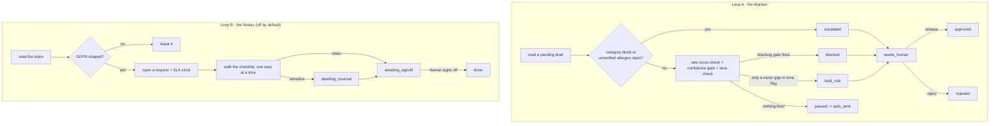

# AI Manager / Overseer — "The Warden"

The supervisor of the team: it watches every agent's output in real time and holds anything that looks wrong before it reaches a guest.

## What it does

The supervisor of the team. It watches every agent's output in real time, and the instant something looks off (wrong tone, a bad fact, a price out of band) it pulls that agent off the field and alerts a human. It also runs the daily review loop and can pause or resume any agent on command.

## What it won't do

Won't silently override a human decision; when it intervenes, it says what it caught and why.

## Why it matters

It's the safety layer that lets you trust the doers. One agent watching all the others means you can run the team at full autonomy without turning risk up.

## What to expect

Watches the whole roster so you can run agents at full autonomy; targets <1 bad message ever reaching a guest.

The roster text above is quoted exactly as it appears on the demo platform's
agent menu - this repo does not promise more than that, and does not
promise less. The measured version of that promise - how many bad
messages this repo actually caught - is `make report`; see "Measuring the
benefit" below.

## Who it's for

Properties already running more than one AI agent against guest-facing
channels - a front desk, an upsell agent, a review-response agent, a
concierge - who want one shared safety layer instead of trusting each
agent's own judgement alone. It also fits any property in the EU or UK, or
handling EU/UK guests' data, that wants a real, auditable desk for GDPR
access/erasure/rectification requests instead of working them by hand in a
spreadsheet.

You will get the most from this repo if:

- You have at least one other agent (here or elsewhere) drafting guest
  replies, and you want a second, independent check on what it is about to
  send.
- You have a PMS or a CSV export of your rates, so the rate cross-check has
  something real to compare a quote against.
- You get GDPR-shaped requests often enough that a checklist and a
  countdown clock are worth more than a shared inbox label.

It is less of a fit if you are running a single simple agent with nothing
else to screen, or if your only guest channel is a booking platform your
staff already reads by hand - there is nothing for the Warden to watch.

**Restaurant lens.** The promise is venue-neutral - "reads what every other
agent is about to send and pulls anything that looks wrong... then tells a
person what it caught and why" - but what counts as "a price out of band"
becomes a menu price or a minimum spend rather than a room rate, and an
allergen or dietary claim becomes the highest-severity check in the repo,
non-overridable, because a wrong room rate costs money and a wrong allergen
answer is a safety incident. The shipped rate cross-check itself still
compares against a PMS rate, since this repo's fixtures are a hotel; a
restaurant deployment swaps that for the POS item master - see
`docs/integrations.md`.

## How it works

Two independent loops, one shared safety pattern: read something another
part of the operation produced, run it through deterministic rules, and
either clear it or hold it for a human. No model call in either loop - the
only LLM call in this repo is the daily governance note.



### The two modes

| Mode | What happens |
|---|---|
| `shadow` (default) | Both loops read, screen and queue. Nothing is ever sent: the duty-manager alert on a hold or a release, and the Notary's requester correspondence, are all blocked and recorded instead. |
| `live` | A released hold's duty-manager alert, and a signed-off GDPR request's delivery email, really go out. Every rule threshold behaves identically in both modes - `mode` never changes what gets held. |

### The review loop

A screened draft that is `blocked`, `held_rule` or `escalated` waits for a
human. `workflows/80-review.md` covers `release` / `reject` / the honestly
simulated `pause` / `resume` in full.

### What runs when

| Workflow | Cadence | Provider used |
|---|---|---|
| `workflows/10-screening.md` (`tools/run.py`) | every 2 minutes (`config/agent.yaml: schedule.screening`), or `make watch` | none - screening is deterministic |
| `workflows/15-daily-digest.md` (`tools/digest.py`) | daily, 08:00 | whatever `llm.provider` is set to (the one LLM call in this repo) |
| `workflows/20-compliance-gdpr.md` (`tools/gdpr.py sweep`) | every 30 minutes, only meaningful once the Notary is on | none - the checklist is deterministic |
| `workflows/80-review.md` (`tools/review.py`) | whenever a human is available | none - queue operations only |

See `docs/how-it-works.md` for the full decision table, the design
decisions this repo makes where the behavioural brief was open, and the
idempotency guarantees.

## What you need

| Item | Required? | Notes |
|---|---|---|
| A computer or small server that can run Python 3.11+ | Yes | Your laptop is fine to start; `workflows/90-go-live.md` covers scheduling it properly. |
| A Claude Code subscription, or your own Anthropic API key | Yes | Only for the daily governance note - the `interactive` provider uses the Claude Code session you already have open, zero extra cost. |
| A PMS, or at least a CSV export of your rates | Recommended | Powers the rate cross-check. Starts on `mock` fixtures. |
| A way for other agents to hand the Warden a draft | Recommended | Starts on the bundled fixtures - see `docs/integrations.md` for the drop-file recipe. |
| A messaging channel for the duty manager (WhatsApp via your own UniPile account, or a webhook) | Recommended | Starts on `mock`; this is how the Warden and the Notary actually alert a human. |
| A mailbox, if you turn on the Notary | Only if you enable Compliance / GDPR AI | Starts on `mock` fixtures either way. |

Time estimate: 15 minutes to see the demo, half a day to connect a real
draft feed and messaging channel, a few days of watching the review queue
before you would reasonably consider going live.

## Quick start (5 minutes, no credentials)

```bash
git clone https://github.com/th1-ai/ai-manager-overseer.git ai-manager-overseer
cd ai-manager-overseer
make setup
make demo
```

You should see something like this (the request ids are random each run):

```
AI Manager / Overseer demo - 6 draft(s) to screen, plus the Notary's inbox check

Loop A - the Warden

  draft-01: Front Desk AI -> T. Solberg  verdict=blocked     (rate-crosscheck, confidence-gate)
  draft-02: Front Desk AI -> M. Ahonen  verdict=held_rule   (rate-crosscheck)
  draft-03: Upsell AI -> P. Nair  verdict=escalated   (category-blocks)
  draft-04: Concierge AI -> H. Berge  verdict=escalated   (allergen-check)
  draft-05: Front Desk AI -> T. Solberg  verdict=passed      (-)
  draft-06: Review-Response AI -> M. Ahonen  verdict=held_rule   (tone-check)

1 passed straight through, 1 blocked, 2 held, 2 escalated.
Duty-manager alerts on every blocked/escalated draft were attempted and blocked by shadow mode - see data/logs/*.jsonl.

Loop B - the Notary (off by default; run here too so the demo proves both loops) - 6 sample email(s) checked

  email-01: erasure request from M. Halvorsen -> gr-68e44cb778 (8 days left, status=open)
  email-02: access request from Priya Nair -> gr-077e93f9ab (27 days left, status=open)
  email-03: rectification request from Halvor Berge -> gr-772207af05 (25 days left, status=open)
  email-06: erasure request from J. Reyes -> gr-35d6a869b6 (23 days left, status=awaiting_counsel)

4 GDPR-shaped request(s) opened; 2 email(s) were not GDPR-shaped and left for whichever agent handles the guest inbox.

Nothing was sent or delivered: mode is shadow, and demo never calls send() at all.
Next: `make review` to see what is waiting for a human, or read workflows/10-screening.md.

DEMO OK — 10 items processed, 10 drafted, 0 sent (shadow)
```

`draft-01` reproduces the source engine's own worked example almost exactly:
a Front Desk AI reply quoting EUR 212 for a Deluxe Sea View the PMS prices
at EUR 460 (a 54% gap), at 54% confidence - both the confidence gate and
the rate cross-check fire, and the draft is blocked. To see the same draft
pass instead, flip either rule off in `config/agent.example.yaml` (the
demo's own config: `make demo` always runs on the shipped sample files,
never your live config) and re-run `make demo`; flip it back after. In a
real run (`make run`), the same toggles live in `config/agent.yaml` - that
toggle is the whole argument for this repo.

Then `make doctor` - expect one `FAIL` (`hotel identity`, because the
property is still the shipped placeholder "The Marlow House") and 3 `warn`
lines (`mode`, `knowledge`, `agent knowledge`). That is the intended state
of a fresh clone; see `workflows/00-setup.md` for filling in the real
property.

## Set up with Claude Code

Open `claude` in this folder. Paste each prompt below in order - Claude
will follow the named workflow file, which tells it exactly which tools to
run and what to check.

**Phase 1 - first run.**

> Read `workflows/00-setup.md` and walk me through it. I have not run this
> agent before.

**Phase 2 - the screening loop.**

> Read `workflows/10-screening.md`. Run one pass and show me what the
> Warden did with each draft in plain language.

**Phase 3 - the review queue.**

> Read `workflows/80-review.md`. Show me what is waiting for me, one at a
> time, and act on my decisions.

**Phase 4 - the daily governance note.**

> Read `workflows/15-daily-digest.md` and run it. Read the note back to me.

**Phase 5 - Compliance / GDPR AI (only if you handle EU/UK guest data).**

> Read `workflows/20-compliance-gdpr.md` and help me decide whether to turn
> the Notary on. If we do, walk me through catching and closing one real
> request.

**Phase 6 - going live.**

> Read `workflows/90-go-live.md`. Go through the checklist with me honestly
> - do not recommend going live until it is genuinely true.

## Connect your systems

Full detail, exact env vars and the "implement your own" recipe:
`docs/integrations.md`. Check what is actually working at any time:

```bash
make doctor
```

### PMS - `systems.pms.adapter` (reads only)

| Adapter | Status | Needs |
|---|---|---|
| `mock` | universal | nothing - reads `fixtures/hotel/*.json` |
| `csv` | universal | a rates export in `data/imports/rates.csv` |
| `cloudbeds` | built | OAuth app + refresh token |

The Warden never writes to the PMS. Only `get_rates()` is used, for the
rate cross-check.

### The draft feed - `config/agent.yaml: draft_feed` (not a core adapter)

| Adapter | Status | Needs |
|---|---|---|
| `mock` (default) | universal | nothing - reads `fixtures/inbound/drafts/*.json` |
| `dir` | universal | a drop folder, default `data/imports/drafts` |

This is how another agent hands the Warden a draft to screen. See
`docs/integrations.md` for the exact record shape and the wiring recipe.

### Email - `systems.email.adapter`

| Adapter | Status | Needs |
|---|---|---|
| `mock` | universal | nothing - reads `fixtures/inbound/*.json` |
| `imap` | universal | mailbox + app password |
| `gmail` | built | Google OAuth desktop client |

Used by the Notary only: inbox intake, and the delivery/acknowledgement
email on `signoff`. Not used at all while `subagents.compliance_gdpr` is
off.

### Messaging - `systems.messaging.adapter`

| Adapter | Status | Needs |
|---|---|---|
| `mock` | universal | nothing |
| `unipile` | built | your own UniPile account |
| `webhook` | universal | `MESSAGING_WEBHOOK_URL` - POST to Zapier, Make, n8n, or your own endpoint |

This is how the duty manager actually hears about a block, an escalation,
a release, or a GDPR deadline at two days or under
(`python3 tools/gdpr.py sweep`).

### Sheets - `systems.sheets.adapter`

| Adapter | Status | Needs |
|---|---|---|
| `csv` | universal | nothing - writes `data/exports/*.csv` |
| `google` | built | service account JSON |

Not written to by this repo's own tools yet; `make doctor` still reports it
since every repo in the family configures the same four systems.

### Everything else

`pos`, `accounting`, `reviews`, `calendar`, `payments`, `procurement`,
`locks` and `courier` are **stubs** - this agent does not use any of them.
If a restaurant deployment wants the menu-price cross-check the roster's
restaurant lens describes, `docs/integrations.md` has the five-step
"Implement your own" recipe for wiring the `pos` stub to a real POS.

## Run it

```bash
make run                          # one pass: screen every pending draft
make run ARGS="--limit 5"         # just the first five drafts
make run ARGS="--dry-run"         # compute everything, write nothing
make watch                        # keep the screening loop running
python3 tools/digest.py            # the daily governance note
python3 tools/gdpr.py intake       # (Notary) catch requests in the inbox
python3 tools/gdpr.py sweep        # (Notary) the SLA digest
```

**The review queue.** `make review` shows what is waiting;
`workflows/80-review.md` covers `release` / `reject` / `pause` / `resume`
in full.

**Scheduling.** `config/agent.yaml`'s `schedule:` block names every job
this agent actually needs - `screening` (every 2 minutes), `daily_digest`
(08:00) and `compliance_gdpr` (every 30 minutes, only meaningful once the
Notary is on) - each with its own real command. Print all three, already
filled in with the right absolute paths for this machine, with:

```bash
make schedule ARGS="--all"
```

Paste that straight into `crontab -e`. `scheduler/crontab.example`,
`scheduler/launchd.example.plist`, `scheduler/systemd.example.service` and
`scheduler/systemd.example.timer` have one hand-editable example each, for
a Mac, a Linux box, or a VPS, if you would rather not use `--all`.

**Subscription or API.** `llm.provider: interactive` or `claude-code` runs
the one daily prompt in this repo on the Claude Code subscription you
already pay for - the cheapest way to run this, with the caveat that
Anthropic's usage policy governs automated use of a personal subscription
(one scheduled run a day is normal; do not point a busy pipeline at it).
`llm.provider: anthropic` uses your own API key and bills per token.
`make report` shows what you are actually spending either way; see
`docs/safety.md` for the full honest note.

## Go live

Shadow mode is the default and stays the default until you change it. The
full checklist - real config filled in, a few days of real screening behind
you, a real messaging channel connected, at least one GDPR request walked
end to end if the Notary is on - is in `workflows/90-go-live.md`. In short:

```yaml
mode: live   # config/hotel.yaml
```

then

```bash
python3 tools/review.py stale
```

to clear whatever piled up during shadow, so nothing old releases by
surprise the moment live mode starts. Going live never loosens a rule
threshold and never lets the Warden draft or send a guest-facing reply
itself - it only lets a released hold's alert, and a signed-off request's
delivery email, really leave the building.

## Guardrails & safety

Full detail: `docs/safety.md`. In short:

- **Five deterministic checks, always in this order:** category block,
  allergen/safety claim, rate cross-check, confidence gate, tone check -
  see `docs/how-it-works.md`. No model decides a verdict; the daily
  governance note is the only LLM call in the repo, and it only narrates
  numbers that already exist.
- **A human-only category never gets an AI answer.** Complaint, refund,
  legal, payment, safety, press, large group, medical - configured in
  `config/agent.yaml: category_blocks.categories`.
- **An allergen or dietary claim must be confirmed in
  `knowledge/allergens.md`**, close to verbatim, or it is escalated. This
  is deliberately the highest-severity check in the repo.
- **Pause is honest.** It is a real capability in production; here it is
  simulated and says so, every time, in the tool's own output.
- **GDPR requests never leave without a human sign-off**
  (`python3 tools/gdpr.py signoff <id>`), and a request whose text matches
  a sensitivity keyword is held for a human to assign before it is worked
  at all.
- **Card numbers and IBANs are redacted on ingestion**, always on, in every
  inbound message the Notary reads.
- **AI-transparency line.** Any correspondence the Notary sends carries the
  disclosure line from `knowledge/signature.md` - EU AI Act Article 50
  guidance and suggested wording are in `docs/safety.md`.

## Sub-agents in this repo

### Compliance / GDPR AI - "The Notary"

**Does.** Catches GDPR/privacy/legal/press requests the moment they arrive
and works each one against the statutory clock, on a visible per-request
checklist: verify the requester's identity, locate the guest's data across
PMS, comms and billing archives, compile the export, redact third-party
data, check legal holds before any erasure, deliver via secure link.
Manages consent and retention rules, keeps a live days-left countdown on
every open request, and routes anything sensitive to a human instantly.

**Won't.** Never decides a legal question alone - it prepares, documents
and counts down; a human signs off before anything leaves.

**Why.** One mishandled data request is a real liability; this is the
seatbelt.

**Output.** 100% of sensitive requests caught and worked on a checklist;
nothing slips past day 30, audit trail by default.

**Off by default** - the Warden is fully useful without it, since
screening another agent's drafts does not need the privacy desk. Turn it
on in `config/agent.yaml: subagents.compliance_gdpr.enabled` once you want
statutory requests worked here; see `workflows/20-compliance-gdpr.md` and
`docs/sub-agents.md` for exactly what it narrows from the promise above and
why.

## Customising

- **`knowledge/allergens.md`** - the confirmed dietary/allergen facts the
  allergen check trusts. Nothing here is invented; a wrong entry is a wrong
  answer to a guest.
- **`knowledge/gdpr-intake-phrases.md`** - the phrases the Notary matches
  an inbound email against, per kind. Tune this against your own traffic.
- **`knowledge/retention-policy.md`** - the human-readable version of
  `config/agent.yaml: gdpr.retention_holds`; keep the two in sync.
- **`config/agent.yaml`** - every threshold (`confidence_threshold`,
  `rate_block_threshold_pct`, `rate_held_threshold_pct`), the human-only
  category list, the tone check's forbidden phrases, the GDPR checklists
  per kind, and the `schedule:` block.
- **`prompts/governance-note.md`** - the one prompt in this repo. Plain
  markdown; edit it directly and re-run `python3 tools/digest.py`.
- **Adding a jurisdiction.** `config/agent.yaml: gdpr.sla_days_default` and
  `gdpr.retention_holds` are both configuration, not code - a property
  outside the EU/UK with a different statutory window changes one number,
  not a line of Python.

## Troubleshooting & FAQ

Full detail: `workflows/99-troubleshooting.md`.

**Why did a draft with no price get held?** The rate cross-check only runs
when a draft carries `quoted_price`, `room_type_id` and `check_in`. A draft
missing any of those is still checked by the other four rules.

**Why does `make doctor` fail on a fresh clone?** The property name is
still the shipped placeholder ("The Marlow House") - fill in
`config/hotel.yaml`. This is the intended state; see `workflows/00-setup.md`.

**Can the Warden fix a bad draft itself?** No. It only ever holds or
clears another agent's own draft text - it never rewrites anything. A
release sends the draft exactly as the originating agent wrote it.

**Does pausing an agent actually stop it?** Not from this repo alone - see
"Guardrails & safety" above. It is a real, honestly-documented gap, not a
hidden one.

## Measuring the benefit

Full detail: `docs/benefits.md`. `make report` reads straight from
`data/agent.db`: drafts screened by verdict (the measured version of the
roster's "targets <1 bad message ever reaching a guest"), the intervention
rate, the open privacy queue and its nearest deadline, and what the one
LLM call in this repo has cost.

## About

Built by [TH1](https://th1.ai) as part of its family of open-source hotel
AI-agent templates. Licence: MIT (`LICENSE`). Want a whole team of these
running for you, tuned to your property, without doing the setup yourself?
[Get in touch](https://th1.ai).

**Changelog.** v1 - initial release: the Warden's five-check screener and
the Notary's request desk, both deterministic; the daily governance note
as the one LLM call.
