# How AI Manager / Overseer works

AI Manager / Overseer ("The Warden") is the safety layer that sits between
every other agent's drafts and the guest: it screens what another agent is
about to send, holds anything that looks wrong, and tells a human what it
caught and why. Compliance / GDPR AI ("The Notary") is folded into this same
repo: it catches privacy/legal requests in the inbox and works each one
through a statutory checklist against a countdown clock.

Both are deliberately LLM-free where it matters. The only model call either
one makes is a short daily prose note that never changes a decision.

## The two loops

```mermaid
flowchart TD
    subgraph Warden["Loop A - the Warden (tools/run.py)"]
        A1[read a pending draft\nfixtures/inbound/draft-*.json or data/imports/drafts/] --> A2{already screened?}
        A2 -- yes --> AZ[skip]
        A2 -- no --> A3[category block?]
        A3 -- human-only category --> AE[escalated]
        A3 -- no --> A4[allergen / safety claim unverified?]
        A4 -- yes --> AE
        A4 -- no --> A5[rate cross-check vs PMS]
        A5 --> A6[confidence gate]
        A6 --> A7[tone check]
        A7 --> A8{any rule fired?}
        A8 -- blocking gate or big rate gap --> AB[blocked]
        A8 -- minor rate gap or tone flag only --> AH[held_rule]
        A8 -- nothing fired --> AP[passed]
        AB --> AQ[needs_human: review queue]
        AH --> AQ
        AE --> AQ
        AP --> AA[auto_sent: cleared, no human needed]
        AQ -- release the hold --> AR[approved -> sent: release recorded]
        AQ -- reject --> AJ[rejected: stays held]
    end
    subgraph Notary["Loop B - the Notary (tools/gdpr.py)"]
        B1[read inbox: fixtures/inbound/email-*.json] --> B2{GDPR-shaped request?}
        B2 -- no --> BZ[not ours - leave for the front-desk agent]
        B2 -- yes --> B3[open gdpr_requests row + SLA clock]
        B3 --> B4[walk the checklist, one step at a time]
        B4 --> B5{sensitive? legal/press/counsel keyword}
        B5 -- yes --> B6[awaiting_counsel: human assigns]
        B5 -- no --> B7[awaiting_signoff]
        B6 --> B7
        B7 -- human signoff --> B8[done: outcome recorded]
    end
```



`tools/engine.py:screen_draft()` is the whole Warden decision for one draft.
`tools/gdpr.py` holds the Notary's intake classifier, checklist walker and
SLA math. Neither ever calls a model — see "Deterministic decisioning" below.
`tools/digest.py` is the one place either one calls the LLM (`prompts/
governance-note.md`), to write a few sentences summarising what already
happened. `tools/fleet.py` holds the (simulated) pause/resume state a human
uses from the review queue.

## Deciding a verdict — the Warden

`tools/engine.py:screen_draft()` runs five deterministic checks in a fixed
order and returns one of four verdicts, matching every state in the source
engine's `Verdict` type (the demo this was built from could only ever reach
`blocked`/`passed` — see "Design decisions" below for how `held_rule` and
`escalated` became reachable):

```
1. category block      draft.category in config: category_blocks.categories
                        -> escalated (rule: category-blocks)
2. allergen/safety      draft.claims contains an unverified dietary/allergen
                         assertion -> escalated (rule: allergen-check)
3. rate cross-check      gap_pct = round((pms_rate - quoted_price) / pms_rate * 100)
                         gap_pct >= rate_block_threshold_pct  -> contributes "blocked"
                         gap_pct >= rate_held_threshold_pct   -> contributes "held_rule"
                         (rule: rate-crosscheck)
4. confidence gate       draft.confidence < confidence_threshold -> contributes "blocked"
                         (rule: confidence-gate)
5. tone check            a forbidden phrase or shouting -> contributes "held_rule"
                         (rule: tone-check)

verdict = escalated  if step 1 or 2 fired (highest severity, human-only)
        = blocked    elif step 3 or 4 contributed "blocked"
        = held_rule  elif step 3 or 5 contributed "held_rule"
        = passed     otherwise
```

Every fired rule is named in `blockedBy` / `heldBy` / `escalatedBy`, and the
narration always states the evidence (both prices, the score, the phrase) —
this is what "won't silently override a human decision" means in code, not
just in the README.

## Deciding an outcome — the Notary

`tools/gdpr.py:classify_intake()` looks for request-shaped phrases in an
inbound email (see `knowledge/gdpr-intake-phrases.md`) and, when it matches,
opens a `gdpr_requests` row with `kind` (`access` / `erasure` /
`rectification`), `sla_days` (from `config/agent.yaml: gdpr.sla_days_default`,
30 by default) and a checklist copied from `config/agent.yaml:
gdpr.checklists.<kind>`. `slaDaysLeft = sla_days - age_days` where
`age_days = today - received_at`; the card is red under 7 days left and
shows a breach once `slaDaysLeft` goes negative.

`tools/gdpr.py:narrate_step()` keyword-matches each checklist line the same
way the source engine does (identity / locate / legal hold / compile /
redact / deliver / confirm...) and records `done_at` + `done_by` per step —
not all at once (see design decision 4). The last step of every checklist is
a synthetic **human sign-off** that no automated command can complete; only
`tools/gdpr.py signoff <id>` can, and only after every other step is done.

## What runs when

| Workflow | Cadence | Provider used |
|---|---|---|
| `workflows/10-screening.md` (`tools/run.py`) | every 2 minutes (`config/agent.yaml: schedule.screening`), or `make watch` | none — screening is deterministic |
| `workflows/15-daily-digest.md` (`tools/digest.py`) | daily, 08:00 | whatever `llm.provider` is set to (the one LLM call in this repo) |
| `workflows/20-compliance-gdpr.md` (`tools/gdpr.py`) | every 30 minutes, off by default | none — the checklist is deterministic |
| `workflows/80-review.md` (`tools/review.py`) | whenever a human is available | none — queue operations only |

## Modes

`shadow` (default): screens, logs, queues. Every `notify_staff` call (the
duty-manager alert on a block/escalation) and the Notary's `send()` (the
requester acknowledgement / delivery link) go through `core.review.py`
exactly like every other repo in the family, so shadow mode blocks them the
same way it blocks a guest email. `live`: an item a human "released" or a
GDPR delivery a human signed off on can actually notify/send.

## Idempotency

- `store.upsert_item("draft_feed", draft.id, ...)` is unique on
  `(source, external_id)` — re-screening the same draft file twice never
  creates a second item, and `already_processed()` skips anything already
  moved out of `new`.
- `store.upsert_unique("gdpr_request", email.id, ...)` keys a GDPR request
  ledger-style on the source email id, so re-reading the same inbox never
  opens a duplicate request for the same message.
- The Notary's checklist steps are idempotent: `narrate_step()` is a pure
  function of `(step_text, kind)`, and `tools/gdpr.py step`/`run` skip any
  item already marked `done`.
- Release and pause/resume are recorded through `store.transition()` /
  `fleet.py`, which reject an illegal move rather than silently no-op.

## Design decisions where the brief was open

`specs/ai-manager-overseer.md` §11 and `specs/compliance-gdpr-ai.md` §11 list
eleven and eleven open questions respectively (the source demo was a single
scripted incident and a seeded feed, not a real screener — both files say so
explicitly). This repo makes these calls:

1. **A real screening interface, not one scripted incident.**
   `screen_draft()` accepts any draft record shaped like
   `fixtures/inbound/draft-*.json` — this is the actual answer to
   "building the real screening interface is the whole job" (Warden §11.1).
   The interface is a JSON drop file per draft (`fixtures/hotel` naming
   convention: any other agent's `tools/run.py` writes one record to
   `data/imports/drafts/<id>.json` — same shape as `PMS.get_rates()`'s CSV
   convention — before it calls its own `send()`); `docs/integrations.md`
   has the exact recipe. There is no live cross-repo call in this factory
   family (every repo is standalone), so a drop file is the honest answer.
2. **`category-blocks` is implemented**, not just declared (Warden §11.2).
   `config/agent.yaml: category_blocks.categories` lists the human-only
   categories (`complaint, refund, legal, payment, safety, press,
   large_group, medical`); a draft in one of these is always `escalated`,
   never drafted by any AI, matching the roster's promise word for word.
3. **All four verdicts are reachable.** `held_rule` (a rate gap under the
   block threshold, or a tone flag, with nothing worse) and `escalated`
   (category block, or an unverified allergen claim) are real code paths
   with their own tests, not seeded-only states (Warden §11.3).
4. **Confidence is not a constant.** Each draft record carries the
   originating agent's own `confidence` (0-100); this repo does not invent a
   scoring model for another agent's output — that is a contract between
   the doers and the Warden, and each repo in the family states the
   confidence field it emits in `prompts/schemas/`. `docs/integrations.md`
   documents the contract this repo expects (Warden §11.4).
5. **Two of five "wrong tone / bad fact" checks are implemented.** The rate
   cross-check (a bad fact this repo can actually verify against the PMS)
   and an allergen/dietary claim check (the highest-severity bad fact per
   §10's restaurant lens) are real. A general "is this tone off" or
   "is this fact true" check needs a knowledge base per hotel and is left as
   a documented gap — see `docs/safety.md` (Warden §11.5).
6. **The daily review loop is real**, not absent. `tools/digest.py` +
   `workflows/15-daily-digest.md` write one governance note a day from real
   counts in `data/agent.db` — this is what "runs the daily review loop"
   means in this repo (Warden §11.6).
7. **Pause is honestly simulated; resume now exists too.**
   `tools/fleet.py` stores pause/resume state in its own table
   (`agent_fleet`, via `store.migrate()`) and says plainly, everywhere, that
   actually taking a live agent off the field needs that agent's own kill
   switch — this repo cannot reach another repo's process. Resume is the
   same honest simulation the source demo never built (Warden §11.7).
8. **A screened draft is linked to its evidence.** `items.payload` carries
   the draft's `agent`, `channel`, `guest`, `draft_text` and the room/price
   fields used in the rate check, and `items.draft` carries the verdict
   object with the narration — `review.py show <id>` prints the actual text
   a reviewer needs, not just a summary line (Warden §11.8).
9. **Catch-rate is measurable, not asserted.** `tools/report.py` counts
   `escalated`/`blocked`/`held_rule`/`passed` from real rows and reports a
   catch rate; it does not claim -99% because nothing in a fresh clone could
   prove that number (Warden §11.9).
10. **`/ai-analytics`-style fleet metrics are out of scope for v1.** This
    repo's `tools/report.py` covers this agent's own catch rate and the
    Notary's SLA performance; a cross-fleet incident taxonomy belongs to
    whichever agent owns fleet-wide reporting, which the roster does not
    name (Warden §11.10 — left as a gap, not guessed at).
11. **No permission matrix.** `/governance`-style per-action permissions are
    already `config/hotel.yaml: review.require_approval_for`, shared by
    every repo in the family; this repo does not invent a second one
    (Warden §11.11).
12. **GDPR intake is real, not seeded rows.** `tools/gdpr.py:
    classify_intake()` reads the same inbox fixtures a front-desk-style
    agent would and finds the request-shaped ones by keyword — deliberately
    simple, and documented as such (Notary §11.1).
13. **The checklist is walked one step at a time**, each with `done_at` /
    `done_by`, not ticked all at once (Notary §11.2, §11.7).
14. **Legal holds are config, not a hard-coded sentence.**
    `config/agent.yaml: gdpr.retention_holds` is a list of
    `{applies_to, days, basis}` rows; `knowledge/retention-policy.md`
    documents where the numbers come from for this property (Notary §11.3).
15. **A minimal sensitivity classifier exists.** A request whose `kind` is
    legal/press-shaped, or whose free text contains a counsel-worthy keyword
    (`knowledge/gdpr-intake-phrases.md`), is routed to `awaiting_counsel`
    instead of being auto-processed (Notary §11.5).
16. **The promise is narrowed to three kinds on purpose**, matching what the
    data model actually supports: `access`, `erasure`, `rectification`.
    "Press requests" and "legal requests" route to `awaiting_counsel`
    instead of getting their own checklist template — that is the honest
    version of "routes anything sensitive to a human instantly"
    (Notary §11.6).
17. **A human sign-off gates delivery.** The synthetic last checklist step
    (design decision 13 above) is exactly this gate (Notary §11.8).
18. **The SLA countdown is gated by `sla-watch` end to end.** Turning the
    rule off removes the narration; the days-left number itself is a pure
    function of stored data either way, matching the honest "coin toss"
    line the source engine already had (Notary §11.9).
19. **`sla_days` is per-request kind**, from `config/agent.yaml:
    gdpr.sla_days_default`, overridable per row — not a single hard-coded 30
    (Notary §11.10, though 30 remains the correct EU/UK default and is what
    the fixtures use).
20. **No deletion-verification re-scan.** Confirming data is actually gone
    needs write access to five real systems this repo only has read/stub
    access to; `docs/safety.md` states this as an open gap rather than
    claiming it (Notary §11.11).
21. **Fixture identity.** "Hotel Aurora" / "The Marlow House", `example.com`,
    `+1 555 01xx`, invented guest names — matching
    `factory/checks/forbidden.txt` and the rest of the family.

## Where core stops and this agent starts

Everything in `core/` is byte-identical to `factory/core/` and shared by
every repo in the family — see `docs/integrations.md`. Everything in
`tools/`, `prompts/`, `fixtures/`, `workflows/`, `knowledge/gdpr-*.md` and
`config/agent.example.yaml` is this agent's own.
